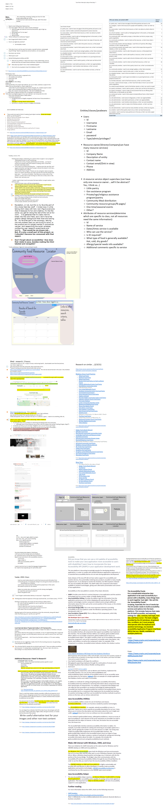

 Time Log

Week 1: 9 hours
Week 2: 13 hours
week 3: 19 hrs

I'm trying to decide how to log, I like OneNote, but not sure how to add that to git hub.
For now I'm just gonna copy/paste my messy notes:
https://onedrive.live.com/view.aspx?resid=ADC24B2EAE462860%21141&id=documents&wd=target%28Enterprise%20Java%20Journal.one%7C4FF3A66C-DC91-429C-AC30-A9B83AE52ECA%2FEnterprise%20Java%20journal%5C%2Ftime%20log%3A%7CA55F188A-660F-4C7D-A65B-6BE737830CF5%2F%29
onenote:https://d.docs.live.net/adc24b2eae462860/Documents/heather's%20Notebook/Enterprise%20Java%20Journal.one#Enterprise%20Java%20journal/time%20log&section-id={4FF3A66C-DC91-429C-AC30-A9B83AE52ECA}&page-id={A55F188A-660F-4C7D-A65B-6BE737830CF5}&end

updating:
