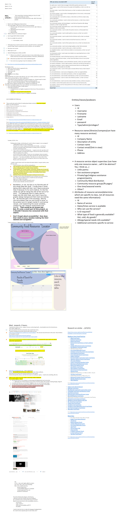

Community Food Resource Locator App

Problem:  With an epidemic raging across our country many people have found themselves facing food insecurity.  Although this is not a new need, there has been in influx of people looking for help for their families, as well as an influx of organizations and people stepping up to meet the need.
Solution:  With the myriad of resources; public, governmental, private, community based, I would like to create an app to help people find these resources and their details.
	
•	Enter a location to find food resources nearest them, details will be shown about how to apply for/get those resources
•	Enter a search term, i.e. “Little Pantry”, “WIC”, “SNAP” to bring up programs relevant
•	?not sure if this is MVP, but volunteer search opportunities
•	Log in
•	Get updates from local resources, news, events

